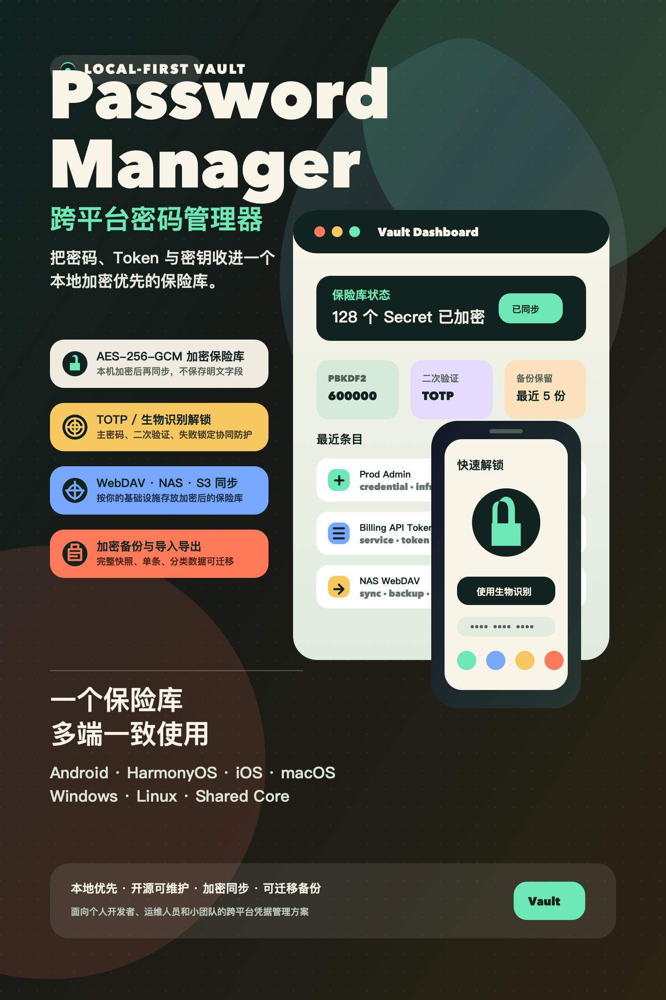

# 跨平台密码管理器



Password Manager 是一款本地加密优先的跨平台密码保险库，用来集中保存用户名、密码、Token、App ID、Access Token、Secret Key、服务器凭据和服务账号等敏感信息。项目目标不是把秘密绑定到某一个云平台，而是在多端原生体验、可审计加密、可控同步和可维护架构之间取得平衡，让个人开发者、运维人员和小团队可以用同一套可信的数据契约管理凭据。

## App 介绍

这款应用围绕“一个保险库，多端一致使用”设计：敏感数据先在本机加密，再按用户选择同步到 WebDAV、NAS、S3 Presigned URL 或对象存储；主密码、TOTP、生物识别和失败锁定共同构成解锁防护；导入、导出和加密备份则保证凭据不会被单一设备或单一平台困住。

它适合保存和管理：

- 网站、后台、开发平台和 SaaS 账号。
- API Token、Access Token、Secret Key、App ID 和服务凭据。
- 服务器、数据库、服务账号、运维环境和团队共享的分类凭据。
- 需要跨 Android、HarmonyOS、iOS、macOS、Windows 和 Linux 使用的本地优先密码库。

## 核心能力

- **本地加密保险库**：使用 PBKDF2-SHA256 派生密钥，并通过 AES-256-GCM 加密 vault payload；持久化文件不保存明文密码库字段。
- **多类型 Secret 管理**：支持 credential、server、service 等条目类型，并提供分类、标签、搜索、过滤和软删除能力。
- **多重解锁防护**：支持主密码、TOTP 二次验证、失败次数限制，以及已接入平台能力的生物识别解锁。
- **可控同步**：围绕 WebDAV、NAS WebDAV、S3 Presigned URL 和对象存储设计同步接口、revision、冲突策略和同步日志。
- **备份与迁移**：支持本地加密备份、快照 JSON 导入导出、单条或分类导入导出，以及冲突处理策略。
- **跨端一致契约**：共享 Dart 包、Swift/Kotlin 原生实现和 C++ portable core 围绕同一数据模型、加密格式和同步语义演进。
- **字段关联契约**：分类模板字段可声明可选的单条记录引用，引用值使用稳定条目 ID；标签继续用于宽松分组、搜索和筛选。当前已完成全端无损读写、五态解析、生命周期传播、安全搜索、同批复制导入 ID 重映射和同步冲突保真；关联编辑与详情 UI 仍按平台分阶段开放，完整格式与上线约束见 `docs/FIELD_REFERENCE_CONTRACT.md`。

## 当前状态

这是一个正在建设中的开源项目。共享核心能力与多端原生切片已经逐步落地，但不同平台的 UI 完整度、发布签名和真实设备验证进度不同，生产发布前仍需要完成对应平台的发布门禁、真实同步服务验证和商店审核材料。

| 平台 | 当前进度 |
| --- | --- |
| Android 原生 | 已覆盖初始化/解锁、条目管理、TOTP、同步设置、导入导出、备份、折叠屏/大屏适配和 release gate。 |
| HarmonyOS 6 原生 | 已完成 Stage 工程、离线 MVP、CryptoArchitectureKit 加密、TOTP、生物识别、同步状态机、导入导出和 HAP 校验链路。 |
| macOS 原生 | 已有 SwiftUI app、Keychain/Touch ID 解锁、同步中心、备份中心、导入导出中心和本地打包验证。 |
| iOS 原生 | 已建立 SwiftPM core 与 Xcode app target，复用已验证的 Swift 核心能力，并通过 simulator smoke 验证首屏。 |
| Windows / Linux | 已有共享 C++17 core 和 terminal-native CLI，覆盖加密 vault、TOTP、CRUD、备份、导入导出和远端对象同步；图形界面仍在补齐。 |
| 共享 packages | Dart `crypto`、`storage`、`sync`、`auth`、`backup`、`core` 包提供跨端契约和测试基线。 |

## 项目结构
- `apps/android_native`: Android 原生应用
- `apps/harmony_app`: 鸿蒙 6（Stage 模型）应用
- `apps/ios_native`: iOS 原生应用
- `apps/macos_native`: macOS 原生应用
- `apps/windows_native`: Windows 原生应用
- `apps/linux_native`: Linux 原生应用
- `apps/native_core`: Windows / Linux 共享 C++ 核心
- `packages/crypto`: AES‑256 加密服务
- `packages/storage`: 加密本地存储
- `packages/sync`: 云 / NAS 同步接口
- `packages/auth`: 2FA（TOTP）服务
- `packages/backup`: 加密备份服务
- `packages/core`: 领域模型与编排逻辑

## 开发步骤
### 1. 环境准备
- 共享 Dart 包测试需要安装 Dart SDK，并确保 `dart` 可在终端直接使用。
- 各原生端需要安装对应平台工具链，详见各 `apps/*_native/README.md` 和 `apps/harmony_app/README.md`。
- 可选：安装 `melos` 以管理多包仓库
  - `dart pub global activate melos`

### 2. 安装依赖
如果使用 melos：
- `melos bootstrap`

不使用 melos 时，可按需进入具体 package 执行 `dart pub get`，或进入具体原生端目录执行对应平台的依赖安装命令。

### 3. 运行应用
- Android：见 `apps/android_native/README.md`
- HarmonyOS：见 `apps/harmony_app/README.md`
- iOS：见 `apps/ios_native/README.md`
- macOS：见 `apps/macos_native/README.md`
- Windows / Linux：见 `apps/windows_native/README.md`、`apps/linux_native/README.md` 和 `apps/native_core/README.md`

**HarmonyOS（HAP 重编译）**

```bash
./scripts/harmony_preflight.sh
./scripts/harmony_build_hap.sh
```

**HarmonyOS（Signed HAP 重编译）**

```bash
./scripts/harmony_preflight.sh
./scripts/harmony_build_signed_hap.sh
```

### 4. 测试
- macOS/Linux：`./scripts/test_all.sh`
- Windows：`powershell -ExecutionPolicy Bypass -File .\\scripts\\test_all.ps1`
- Windows/Linux 原生端：`./scripts/verify_desktop_native.sh`
- 字段关联共享 fixture：`node scripts/verify_vault_contract_fixtures.mjs --check`

### 4.1 测试可行性说明（macOS）
- **全量共享包测试** 需要 `dart` 命令。
- 如果提示 `dart: command not found`，说明尚未安装 Dart SDK 或未正确配置 PATH。
- 原生端构建、设备冒烟和发布验证请按对应 app 目录 README 执行。
- Windows/Linux 原生端本机 release gate 会构建共享 C++ release binary、运行 CLI `self-test` 和启用 `assert` 的 core/CLI smoke，并校验 Windows release contract 与 Linux host binary 依赖；Linux 真实 userspace 和 `.deb` 安装验证可通过 `./scripts/verify_desktop_native.sh --linux-docker` 追加执行。

### 4.2 Android 打包发布（APK / AAB）
1) 进入原生 Android 目录：
   - `cd apps/android_native`
2) 构建产物：
   - AAB: `./gradlew :app:bundleRelease -PVERSION_NAME=1.2.3 -PVERSION_CODE=45`
   - APK: `./gradlew :app:assembleRelease -PVERSION_NAME=1.2.3 -PVERSION_CODE=45`

### 4.3 HarmonyOS 6 打包发布（HAP）
1) 预检与构建  
   - `./scripts/harmony_preflight.sh`  
   - `./scripts/harmony_build_hap.sh`（生成 unsigned HAP）  
   - `./scripts/harmony_build_signed_hap.sh`（生成 signed HAP）  
2) 签名配置文件  
   - 签名变量文件：`apps/harmony_app/signing/signing.env`  
   - 模板文件：`apps/harmony_app/signing/signing.env.example`  
3) 签名链路文件说明（`signing.env` 关键字段）  
   - `HARMONY_SIGN_STORE_FILE`：签名密钥库文件（通常是 `release.p12`）。  
     作用：保存私钥，用于最终给 HAP 签名。  
     获取方式：在 DevEco Studio 生成密钥库（创建 Key/CSR 时产生），或由团队统一下发。  
   - `HARMONY_SIGN_KEY_ALIAS`：`release.p12` 内的密钥别名（`KEY_ALIAS`）。  
     作用：告诉构建系统使用密钥库中的哪把私钥。  
     获取方式：创建 `p12` 时自定义；若忘记可在团队签名记录或密钥管理页面查询。  
   - `HARMONY_SIGN_PROFILE`：应用签名 Profile 文件（通常为 `.p7b`）。  
     作用：绑定应用包名、证书与发布配置，控制可安装/可发布范围。  
     获取方式：在 AppGallery Connect 证书/Profile 管理中按应用包名生成并下载。  
   - `HARMONY_SIGN_CERTPATH`：证书文件（通常为 `.cer`）。  
     作用：提供公钥证书链信息，与 Profile/私钥组合形成完整签名链路。  
     获取方式：在 AppGallery Connect 下载与当前签名配置匹配的证书文件。  
   - `HARMONY_SIGN_STORE_PASSWORD` / `HARMONY_SIGN_KEY_PASSWORD`：密钥库密码与私钥密码。  
     作用：解锁 `p12` 与私钥。  
     获取方式：创建密钥库时设置，需与团队签名管理记录一致。  
4) 安全要求  
   - `release.p12`、密码、`.p7b`、`.cer` 均为发布敏感材料，不得提交到 Git。  
   - 建议将签名材料存放在受控目录，按环境分开管理（开发/测试/生产）。  
5) 参考文档  
   - `apps/harmony_app/docs/SIGNING_SETUP.md`  
   - `apps/harmony_app/docs/DEVECO_BUILD_AND_DEVICE_VALIDATION.md`  

### 5. 全量测试（推荐）
- macOS/Linux：`./scripts/test_all.sh`
- Windows：`powershell -ExecutionPolicy Bypass -File .\\scripts\\test_all.ps1`
- Windows/Linux 原生端：`./scripts/verify_desktop_native.sh`

### 6. 仅 Dart 包测试
- macOS/Linux：`./scripts/test_dart_only.sh`
- Windows：`powershell -ExecutionPolicy Bypass -File .\\scripts\\test_dart_only.ps1`

## 分步开发计划（里程碑）
### 阶段 1：MVP（本地离线 + 基础加密）
**迭代 1.1：数据模型与加密管线**
- 定义 VaultItem / CredentialPayload 数据结构
- AES‑256‑GCM 加密/解密实现
- 密钥派生（PBKDF2）与盐存储格式
- 加解密一致性测试

**迭代 1.2：本地存储与仓库实现**
- 本地加密存储实现（文件 / SQLite 二选一）
- VaultRepository 具体实现
- 基础 CRUD 测试

**迭代 1.3：基础 UI**
- 新增/查看条目 UI
- 表单校验与字段遮罩
- 列表展示与详情弹窗

### 阶段 2：同步与备份
**迭代 2.1：同步接口落地**
- 选定一个同步后端（WebDAV / S3 / NAS）
- 实现上传/下载流程
- 同步状态与错误处理

**迭代 2.2：冲突处理**
- 冲突检测策略（时间戳 / 版本号）
- 冲突合并规则与 UI 提示

**迭代 2.3：备份**
- 定期加密备份
- 恢复流程与备份校验

### 阶段 3：认证与安全强化
**迭代 3.1：2FA**
- TOTP 绑定、二维码展示
- TOTP 验证流程

**迭代 3.2：防护措施**
- 解锁失败限流
- 审计日志（本地）

**迭代 3.3：密钥轮换**
- 密钥轮换流程
- 数据迁移与版本升级

### 阶段 4：体验与平台优化
**迭代 4.1：全端适配**
- Windows/macOS/Linux/iOS/Android 适配测试
- 平台权限与安全存储适配

**迭代 4.2：体验优化**
- 搜索、过滤与排序
- 列表性能优化（分页/虚拟列表）

**迭代 4.3：无障碍与主题**
- 多主题支持
- 无障碍支持（大字体/语义标签）

## 安全
详见 `SECURITY.md` 中的安全设计与实践。
